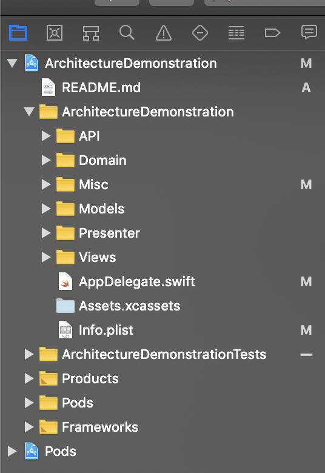

# iOS Architecture Demonstration

## Getting Started

The demonstration app uses Cocoa Pods for dependency management. The app fetches data from the API and displays data in a table view. The app supports offline browsing by caching the first ten items previously fetched. There will be a message shown when the user is browsing the cached data and tells them they are in offline mode.

The purpose of this demonstration is to show a protocol-oriented Hybrid Architecture which follows some pattern of MVVM AND MVP. It has the following features:
1. Scalable
2. Supports multiple sources of data( i.e multiple DBs, APIs etc)
3. Each Layer is responsible for different challenges.

Currently, this demo app has active pagination from a local json due to which it supports infinite scrolling as well, Further, this architecture pattern also supports dependency Injection and, also have some test cases using a mock API class.

There are mainly 4 Layers in this Hybrid Architecture:
1. API Layer
2. DOMAIN Layer
3. PRESENTATION Layer
4. VIEW Layer

Following is how the XCode directory looks like:



Responsibilities:
1. API Layer holds all the API calls logic, we can also include multiple sources of data e.g coredata or SQLite and API.
2. Domain Layer holds all the brain logic for the app which includes:
  1. Pagination Logic
  2. Which data-source is the current data source, it's the domain that decides should it get data from SQLite/coredata or some API and generates the specific URL if its preparing for making an API call.
  3. Presentation Layer is responsible for preparing specific view-models for ViewController class, It also supports multiple view models for different types of cell but its the presentation layer preparing all the view models as needed.
  4. ViewControllers/ViewLogic: Here, we have the least amount of code except for IBOutlets or registration of XIB files or table view/collection view delegates etc, the view controller acts as a complete dummy sincle all the logic work is already done in Domain Layer.

```
This project was built with Xcode (11.3.1) and Cocoa Pod (1.8.0).
```

## Installing

Pod folder is included with the project to avoid complications with dependency management (i.e. Different versions of the cocoa pod). If the project still fails to compile, please run the following commands.

```
pod deintegrate
pod update
```

When testing on a device, please set the bundle id to a unique one. There seems to be an issue with compiling on a device for iOS13.3.1 with the Alamofire framework being used in this project. Workaround has been implemented and the discussion can be found in the below link. 

https://github.com/Alamofire/Alamofire/issues/3051#issuecomment-581349150

When building to device from XCode, the device requires an internet connection to compile due to the above.


## Running the tests

```
Command + U
```

By pressing Command + U, test cases will run. There are 5 cases in total which focuses on testing the mapping and the data structure of the app. XCTests runs fine on simulator, but does not run properly on device due to framework issues.
